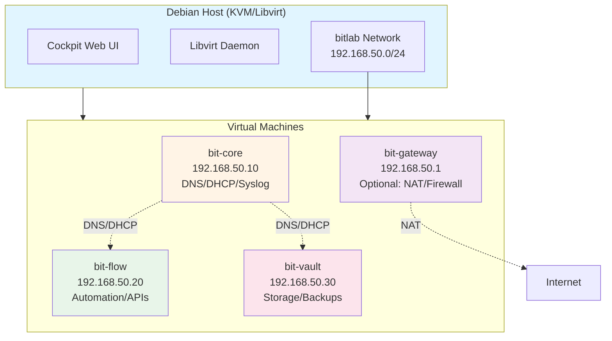

# BIT-Lab - KVM/Libvirt Multi-VM Lab Environment

Reproduzierbare, automatisierte Multi-VM-Umgebung auf Debian mit KVM/Libvirt für IT-Entwicklung, Testing und Automatisierung.

## Architektur



## Voraussetzungen

### Hardware
- **RAM**: Minimum 16 GB (empfohlen: 32 GB)
- **CPU**: Intel VT-x / AMD-V aktiviert, mindestens 4 Kerne
- **Disk**: Minimum 100 GB freier Speicher (empfohlen: 200 GB+)
- **Netzwerk**: Eine physische Netzwerkschnittstelle

### Software
- **Host OS**: Debian 12/13 (Bookworm/Trixie)
- **KVM**: Kernel-basierte Virtualisierung aktiv
- **Libvirt**: Version 8.0+
- **Cockpit**: Mit Machines-Modul installiert
- **Cloud-Image**: Debian Cloud-Image (wird automatisch heruntergeladen)

### System-Checks
Das Deployment-Skript prüft automatisch:
- Root-Zugriff
- Virtualisierung (Intel VT-x/AMD-V)
- Kernel-Module (kvm, virtio)
- Freier Speicherplatz
- Netzwerk-Konfiguration

## Quickstart

### 1. Repository vorbereiten
```bash
cd bit-lab
cp vars.env.example vars.env
# vars.env anpassen (IPs, Ressourcen, Passwörter)
```

### 2. Deployment ausführen
```bash
sudo ./deploy.sh
```

### 3. Validierung
```bash
sudo ./validate.sh
```

### 4. Zugriff
- **Cockpit**: `https://<host-ip>:9090`
- **SSH zu VMs**: `ssh admin@192.168.50.10` (bit-core)
- **Telemetrie**: Öffne `artifacts/status.html` im Browser

## VM-Rollen

### bit-core (192.168.50.10)
- **DNS**: BIND9 für lokale Namensauflösung
- **DHCP**: ISC DHCP Server für statische Leases
- **Syslog**: Zentrales Logging (rsyslog)
- **Monitoring**: Netdata/Zabbix-Agent
- **Ressourcen**: 2 CPU, 4 GB RAM, 20 GB Disk

### bit-flow (192.168.50.20)
- **Automation**: PowerShell Core, Python 3.11+
- **API-Testing**: curl, httpie, REST-Tools
- **M365-Integration**: Graph API, Exchange Online
- **Ressourcen**: 2 CPU, 4 GB RAM, 30 GB Disk

### bit-vault (192.168.50.30)
- **Storage**: NFS, Samba, verschlüsselte Partitionen
- **Backups**: BorgBackup, rsync
- **Ressourcen**: 2 CPU, 4 GB RAM, 50 GB Disk

### bit-gateway (192.168.50.1) - Optional
- **NAT**: IP-Forwarding, iptables
- **Firewall**: UFW, Fail2ban
- **Reverse Proxy**: Nginx (optional)
- **Ressourcen**: 1 CPU, 2 GB RAM, 10 GB Disk

## Netzwerk

### bitlab Network (192.168.50.0/24)
- **Bridge**: `virbr1` (isolierte Bridge)
- **DHCP**: Deaktiviert (nur statische Leases via bit-core)
- **DNS**: Automatische Resolution via bit-core
- **Gateway**: Optional über bit-gateway (wenn aktiviert)
- **Internet**: Nur über bit-gateway (NAT) oder isoliert

### Port-Mappings (Host → VM)
- Keine automatischen Port-Mappings (Security-by-Default)
- Manuell via Cockpit oder `virsh` konfigurierbar

## Sicherheit

### Host-Sicherheit
- SSH-Härtung (keine Root-Login, Schlüssel-basiert)
- Firewall (UFW) aktiviert
- Automatische Updates (kontrolliert)

### VM-Sicherheit
- SSH-Schlüssel statt Passwörter
- Fail2ban auf allen VMs
- Automatische Security-Updates
- Minimale Paket-Installation
- Lesen Sie `hardening.md` für Details

### Secrets-Management
- Keine Passwörter im Klartext
- `.env` / `.secrets` in `.gitignore`
- SSH-Keys in `~/.ssh/`
- Variablen aus `vars.env`

## Wartung

### Snapshots
```bash
# Vor Änderungen
sudo virsh snapshot-create-as bit-core --name pre-update

# Zurücksetzen
sudo virsh snapshot-revert bit-core pre-update

# Oder via Skript
sudo ./revert.sh bit-core pre-update
```

### Backups
- **Täglich**: Automatische Offline-Backups der QCOW-Images
- **Retention**: 7 Tage (konfigurierbar in `vars.env`)
- **Location**: `artifacts/backups/`
- **Restore**: `./restore.sh <vm-name> <backup-date>`

### Updates
```bash
# Auf Host
sudo apt update && sudo apt upgrade -y

# Auf VMs (via Ansible oder manuell)
ansible-playbook ansible/update.yml
```

### Monitoring
- **Netdata**: `http://192.168.50.10:19999` (wenn aktiviert)
- **Status-Page**: `artifacts/status.html`
- **Logs**: `/var/log/syslog` auf bit-core

## Restore & Disaster Recovery

### VM-Wiederherstellung
```bash
# Backup auflisten
ls -lh artifacts/backups/

# VM wiederherstellen
sudo ./restore.sh bit-core 2025-01-15

# Oder komplette Wiederherstellung
sudo ./destroy.sh --confirm
sudo ./deploy.sh
```

### Netzwerk-Reset
```bash
# Netzwerk löschen und neu erstellen
sudo virsh net-destroy bitlab
sudo virsh net-undefine bitlab
sudo ./deploy.sh  # Erstellt Netzwerk neu
```

### Komplett-Reset
```bash
# Vorsicht: Zerstört alle VMs und Daten!
sudo ./destroy.sh --confirm
rm -rf artifacts/backups/
sudo ./deploy.sh
```

## Konfiguration

Alle konfigurierbaren Parameter in `vars.env`:

- **VM-Ressourcen**: CPU, RAM, Disk-Größen
- **IP-Adressen**: Statische IPs für alle VMs
- **Feature-Toggles**: Gateway, Netdata, Auto-Updates
- **Backup-Einstellungen**: Retention, Interval
- **Security**: SSH-Keys, Firewall-Regeln

## Troubleshooting

### VM startet nicht
```bash
# Logs prüfen
sudo journalctl -u libvirtd -n 50
sudo virsh dominfo bit-core

# Cloud-Init Logs
sudo virsh console bit-core
```

### Netzwerk-Probleme
```bash
# Netzwerk-Status
sudo virsh net-info bitlab
sudo ip addr show virbr1

# DNS-Resolution prüfen
dig @192.168.50.10 bit-core.bitlab.local
```

### Performance-Probleme
```bash
# Ressourcen prüfen
sudo virsh dominfo bit-core
htop  # auf Host

# Disk I/O
sudo iotop
```

## Limits & Ressourcenbedarf

### Minimal-Konfiguration (small_footprint=true)
- **RAM**: 12 GB Host-RAM
- **Disk**: 80 GB
- **CPU**: 2 Kerne (ohne Gateway)

### Standard-Konfiguration
- **RAM**: 24 GB Host-RAM
- **Disk**: 150 GB
- **CPU**: 4 Kerne

### Mit Gateway
- **RAM**: +2 GB
- **Disk**: +10 GB
- **CPU**: +1 Kern

## Risiken

### Sicherheit
- **Isoliertes Netz**: Keine automatische Internet-Route
- **Snapshots**: Keine Ersatz für echte Backups
- **Secrets**: Niemals in Git committen

### Performance
- **Resource-Contention**: Bei mehreren VMs gleichzeitig
- **Disk-Space**: QCOW-Images wachsen dynamisch
- **Network-Latency**: Bridge kann Overhead erzeugen

### Datenverlust
- **Snapshots**: Werden bei VM-Löschung entfernt
- **Backups**: Manuell löschen erfordert Bestätigung
- **Cloud-Init**: Überschreibt User-Data bei jedem Boot

## Kommando-Referenz

### Deployment
```bash
sudo ./deploy.sh                    # Vollständiges Deployment
sudo ./deploy.sh --dry-run          # Simulation ohne Änderungen
sudo ./deploy.sh --skip-validation  # Deployment ohne Prüfung
```

### Management
```bash
sudo ./destroy.sh --confirm         # Löscht alle VMs
sudo ./revert.sh bit-core snapshot1 # Snapshot zurücksetzen
sudo ./validate.sh                  # System-Validierung
```

### Virsh-Commands
```bash
virsh list --all                    # Alle VMs auflisten
virsh start bit-core                # VM starten
virsh shutdown bit-core             # VM herunterfahren
virsh console bit-core              # Konsole öffnen
```

## Lizenz & Drittkomponenten

- **KVM/QEMU**: GPL v2
- **Libvirt**: LGPL v2.1+
- **Cockpit**: LGPL v2.1+
- **Debian Cloud Images**: DFSG-kompatibel

## Support & Weiterentwicklung

- **Issues**: GitHub Issues (wenn Repository vorhanden)
- **Updates**: Regelmäßige Security-Updates für Base-Images
- **Erweiterungen**: Ansible-Playbooks für Rollen-Module
- **Cloud-Migration**: Terraform-Skeleton für AWS/Azure/GCP

---

**Wichtig**: Dieses Lab ist für Entwicklung und Testing bestimmt. Nicht für Produktions-Workloads verwenden.


